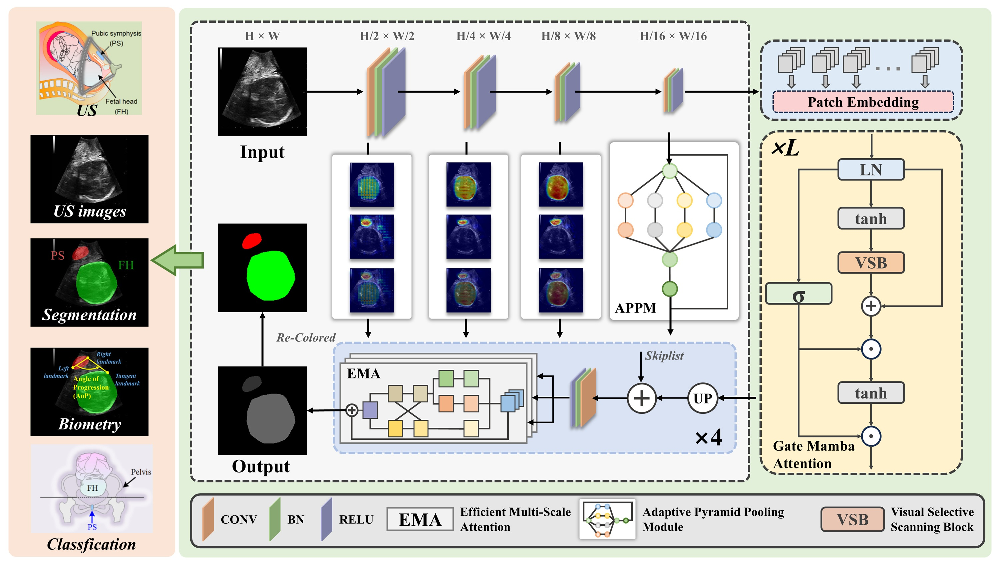
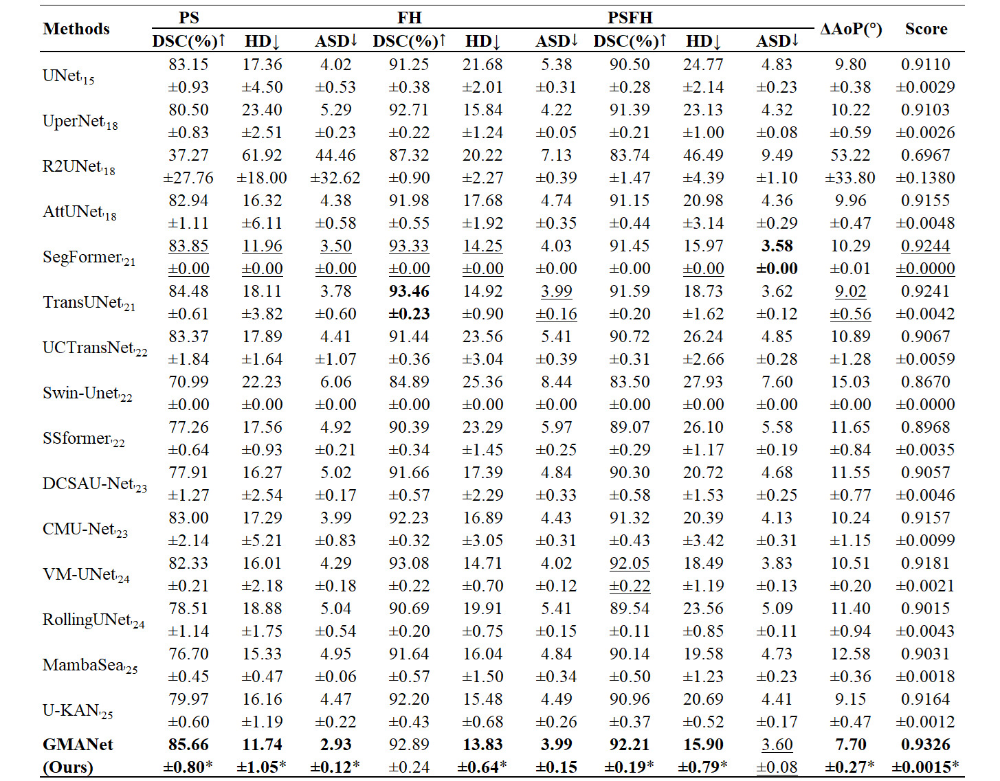
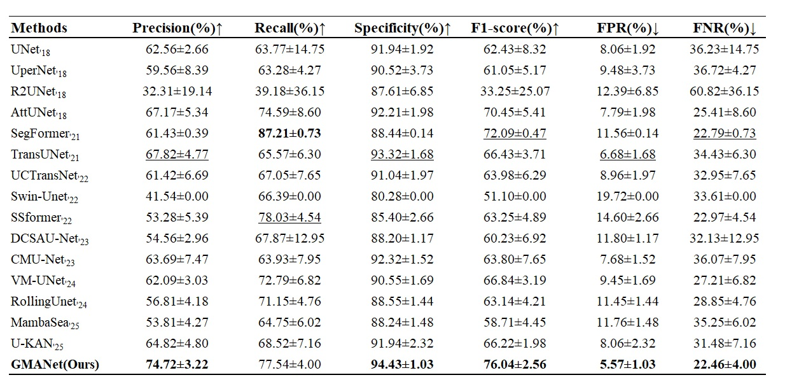
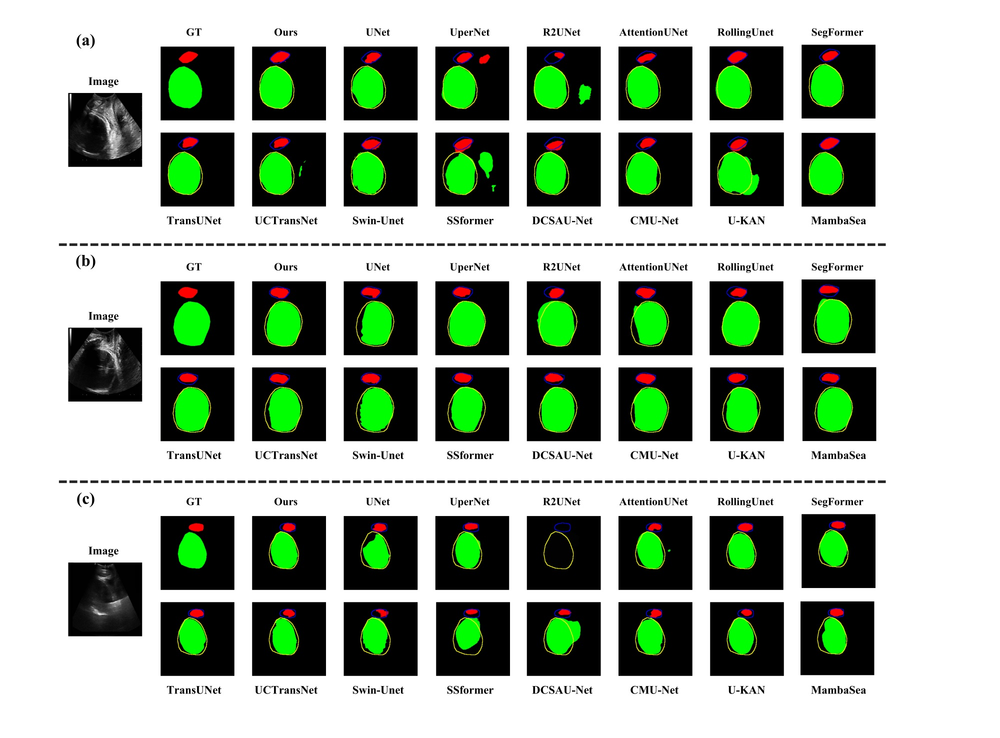

<h2 align="center">GMANet: Gate Mamba Attention for Fetal Head and Pubic Symphysis Segmentation in Ultrasound Images Analysis</h2>


<p align="center">
  <b>
  Mengqing Mei<sup>1,2</sup>
  , Yibo Li<sup>1</sup>
  , Xuannan An<sup>1</sup>
  , Zhiwei Ye<sup>1,2,*</sup>
  , Liye Mei<sup>1,2,3,*</sup>
  </b>
</p>

<p align="center">
  <sup>1</sup>
  School of Computer Science, Hubei University of Technology, Wuhan 430068, China<br>
  <sup>2</sup>
  Hubei Provincial Key Laboratory of Green Intelligent Computing Power Network, Hubei University of Technology, Wuhan 430068, China<br>
  <sup>3</sup>
  School of Electronic Engineering, Hubei University of Technology, Wuhan 430068, China<br>
  <sup>*</sup>
  Corresponding author: Zhiwei Ye (<a href="hgcsyzw@hbut.edu.cn" target="_blank">hgcsyzw@hbut.edu.cn</a>); 
  Liye Mei (<a href="hgcsyzw@hbut.edu.cn" target="_blank">meiliye@hbut.edu.cn</a>);
</p>


<p align="center">
  <b>Our work has been accepted by <i>Digital Signal Processing</i>!<br>
</p>

## Overview
<div>
    
</div>

**Figure 1. The framework of the proposed GMANet.**


**_Abstract -_** Accurate segmentation of fetal heads and the pubic symphysis (PSFH) in ultrasound images during childbirth is crucial for precise angle of progression (AoP) measurements, which enables clinicians to manage dystocia complications effectively. Conventional approaches relying on sonographer-dependent manual selection prove time-consuming and operator-sensitive, while concurrently coping with inherent ultrasound noise, anatomical occlusions, and substantial target shape or location variations. To overcome these challenges in small-target segmentation and boundary delineation, we present GMANet, a novel Mamba-based architecture. Our core design introduces the Gate Mamba Attention (GMA) that synergistically integrates selective state-space modeling with a gating mechanism, where sequence-aware attention of Mamba dynamically focuses on crucial spatial dependencies. At the same time, the fixed-parameter architecture maintains stable local feature extraction. Then we develop an Adaptive Pyramid Pooling Module (APPM) that enhances multiscale discriminability through parallel multi-depth pooling, effectively handling significant size disparities in medical targets. Subsequent feature refinement employs our Efficient Multiscale Attention (EMA) to aggregate multi-receptive-field context through parameter-efficient spatial-channel interactions adaptively. Finally, the proposed GMANet demonstrates statistically significant advantages when benchmarked against contemporary state-of-the-art (SOTA) segmentation methodologies on the PSFH dataset, achieving a composite score of 0.9326, F1-score of 76.04, and ΔAoP of 7.70°. This advancement holds significant promise for automating fetal imaging analysis, potentially improving clinical consistency while reducing operator dependence. Our code is available at https://github.com/AgamLi/GMANet-Gate-Mamba-Attention

## Datasets
To verify the performance of our GMANet in the field of medical image segmentation, we conducted experiments on challenging public PSFH2023 datasets from the MICCAI 2023 Grand Challenge addressing simultaneous pubic symphysis and fetal head segmentation. The retrospective dataset contains 5,101 transperineal ultrasound scans acquired from 1,175 gravidae (age range: 18-46 years) across three tertiary care centers: Nanfang Hospital and Zhujiang Hospital of Southern Medical University, and the First Affiliated Hospital of Jinan University. Collected during second-stage labor initiation assessments, all images maintain original ultrasound acquisition parameters with paired expert-verified segmentation masks for both anatomical structures. The cohort follows a stratified partition protocol: 4,000 training images (305 subjects), 401 validation images (325 subjects), and 700 test images (545 subjects), ensuring subject-level separation between subsets to prevent data leakage.

The dataset is available at [Baidu Cloud Disk](https://pan.baidu.com/s/1o2_bnHX-WgzTMpFEcYKk9g?pwd=fnma) or [Zenodo](https://zenodo.org/records/10969427).


## Experimental Results

**Table 1. Quantitative segmentation evaluation metrics on the PSFH dataset against the comparison methods. The best metrics are displayed in bold. The second-best metrics are underlined. * denotes statistical significance (p<0.05).**
<div>
    
</div>

**Table 2. Quantitative evaluation metrics on the PSFH dataset against the comparison methods. The best metrics are displayed in bold. The second-best metrics are underlined.**
<div>
    
</div>

<br> </br>

<div>
    
</div>

**Figure 2. Visualization of comparison results on the PSFH dataset. (a) The PS segmentation region exhibits partial missing areas. (b) AoP is > 120°. (c) AOP is < 120°. The red area corresponds to the PS, whereas the green area indicates the FH. The blue and yellow contour lines demarcate their ground-truth outlines.**


## Getting Started
### Data Preparation
The dataset should be organised as follows:
```text
PSFH2023
├── image_mha
│   ├── 00001.mha
│   ├── 00002.mha
│   ├── ...
│   └── 05101.mha
├── label_mha
│   ├── 00001.mha
│   ├── 00002.mha
│   ├── ...
│   └── 05101.mha
├── train.txt
├── val.txt
├── test.txt
```

### Requirements
We highly suggest using our provided dependencies to ensure reproducibility:
```
# Environments:
cuda==12.1
python==3.10
# Dependencies:
pip install -r requirements.txt
```

### Training
- To train the model of GMANet, run: `train.py`.

### Testing
- To generate the prediction results, run: `test.py`.

### Evaluation
- To evaluate the model , run: `eval.py`.


## Cite our work
If you find our work useful in your research, please consider citing:
1) Mei, M., Li, Y., An, X., Ye, Z., & Mei, L. (2025). GMANet: Gate Mamba Attention for Fetal Head and Pubic Symphysis Segmentation in Ultrasound Images Analysis. Digital Signal Processing, 105533.https://doi.org/10.1016/j.dsp.2025.105533

```bibtex
@article{mei2025gmanet,
  title={GMANet: Gate Mamba Attention for Fetal Head and Pubic Symphysis Segmentation in Ultrasound Images Analysis},
  author={Mei, Mengqing and Li, Yibo and An, Xuannan and Ye, Zhiwei and Mei, Liye},
  journal={Digital Signal Processing},
  pages={105533},
  year={2025},
  publisher={Elsevier}
}
```

## License
The source code is free for research and education use only. Any comercial use should get formal permission first.
